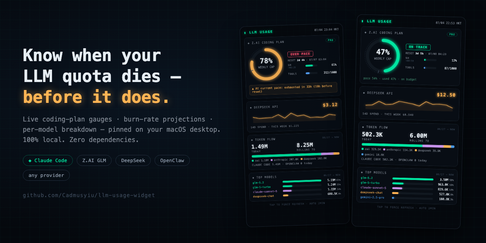

# 🧠 LLM Usage Dashboard

A self-hosted, **100% local** dashboard that tracks your LLM usage across coding plans and pay-as-you-go APIs — live quota gauges, burn-rate projection, per-model attribution, and a desktop widget so you always know whether you'll make it to the reset.

Built for people on **capped LLM coding plans** (Z.AI GLM, Claude, etc.) who want to stop being surprised by "your week is gone."



---

## ✨ Features

- **Live quota gauge + reset countdown** — weekly / 5-hour windows, with pace indicator (on-track / at-risk / over-pace)
- **Burn-rate projection** — "at current pace: exhausted in 33h, 19h before reset"
- **Per-model attribution** — see which model is actually eating your budget
- **Multi-provider** — coding-plan quotas (Z.AI), pay-as-you-go balances (DeepSeek), and local-estimate providers (Grok/xAI). Mix is a JSON config; quota fetchers are pluggable.
- **Budget engine** — pace vs. usage comparison, exhaustion prediction, low-balance warnings
- **Three surfaces:**
  - 🖥️ Full HTML dashboard (Chart.js, served from localhost)
  - 📱 Lightweight JSON API (for mobile widgets — KWGT / Tasker)
  - ⚘️ macOS desktop widget (Übersicht)

## 🔒 Privacy

Everything stays on your machine. API keys are **read at runtime** from where they already live (env vars, macOS Keychain, or Claude Code settings) and are **never written to disk** by this tool. Usage data is parsed locally from your own session transcripts.

---

## 🚀 Quick start

```bash
git clone https://github.com/Cadmusyiu/llm-usage-dashboard.git
cd llm-usage-dashboard

# Static HTML dashboard (one-shot)
python3 generate.py                 # → llm-usage.html (open in browser)
python3 generate.py --watch         # auto-regenerate every 5 min

# Or run the web server + JSON API
python3 dashboard.py --port 8099
```

Then open:
- `http://127.0.0.1:8099/` — full HTML dashboard
- `http://127.0.0.1:8099/api/summary` — lightweight JSON (for mobile widgets)
- `http://127.0.0.1:8099/api/quota` — live provider quotas (120s cache)

**Dependencies:** Python 3 stdlib only (UI is pure SVG + Chart.js via CDN). No `pip install` required.

---

## ⚙️ Configuration

### Where your usage data comes from

By default the dashboard reads:
- OpenClaw agent sessions: `~/.openclaw/agents/main/sessions/sessions.json`
- Claude Code transcripts: `~/.claude/projects/**/*.jsonl`

Point it at your own paths via env vars (no code changes):

```bash
LLMDASH_SESSIONS_PATH=/path/to/sessions.json \
python3 dashboard.py
```

### Provider config (`providers.json`)

Describe your own LLM stack — keys are read from the configured source, never stored:

```json
{
  "id": "deepseek",
  "label": "DeepSeek API",
  "kind": "pay-as-you-go",
  "quota_api": "deepseek-balance",
  "key_source": { "type": "env", "var": "DEEPSEEK_API_KEY" },
  "model_patterns": ["deepseek"],
  "color": "#ffb454"
}
```

- **`kind`**: `coding-plan` (quota gauge) / `pay-as-you-go` (balance + spend line) / `other`
- **`quota_api`**: `zai` / `deepseek-balance` / `openai-usage` / `none` (fetchers are registered in `QUOTA_FETCHERS` — extendable)
- **`key_source.type`**: `claude-settings` / `keychain` / `env` / `literal`
- **`model_patterns`**: attributes usage records to a provider (substring match)

See [`providers.json`](providers.json) for a full sample covering Z.AI, DeepSeek, Grok, and Claude.

---

## 🖥️ Desktop widget (macOS / Übersicht)

The dashboard ships a widget page at `/widget` designed to be embedded in [Übersicht](http://tracesof.net/uebersicht/). Pin it to your desktop; it auto-refreshes every 2 minutes. UI changes only need editing `dashboard.py`.

## 📱 Mobile widget (Android)

See [`ANDROID_WIDGET.md`](ANDROID_WIDGET.md) for KWGT / Tasker setups that poll `/api/summary` over your LAN or Tailscale.

---

## 📁 Project structure

```
llm-usage-dashboard/
├── dashboard.py          # Web server + API endpoints (main entrypoint)
├── generate.py           # Static HTML + Telegram card generator
├── providers.json        # Sample provider config (edit for your stack)
├── llm-usage.html        # Example dashboard output (SVG inline)
├── ANDROID_WIDGET.md     # KWGT / Tasker mobile widget guide
├── LAUNCH_KIT.md         # Promo / launch material
└── social-preview.png    # Repo social card
```

---

## 📝 How the Z.AI quota works

Z.AI has no official quota API. This dashboard calls the same undocumented endpoint the Z.AI web app uses (`api.z.ai/api/monitor/usage/quota/limit`) with a Bearer token read from your Claude Code `ANTHROPIC_AUTH_TOKEN` setting — giving live 5h / weekly / monthly quota percentages and reset times. Falls back to a local estimate (GLM tokens from your sessions/transcripts within the rolling window) if no token is configured.

---

## 📄 License

MIT — see [LICENSE](LICENSE).
